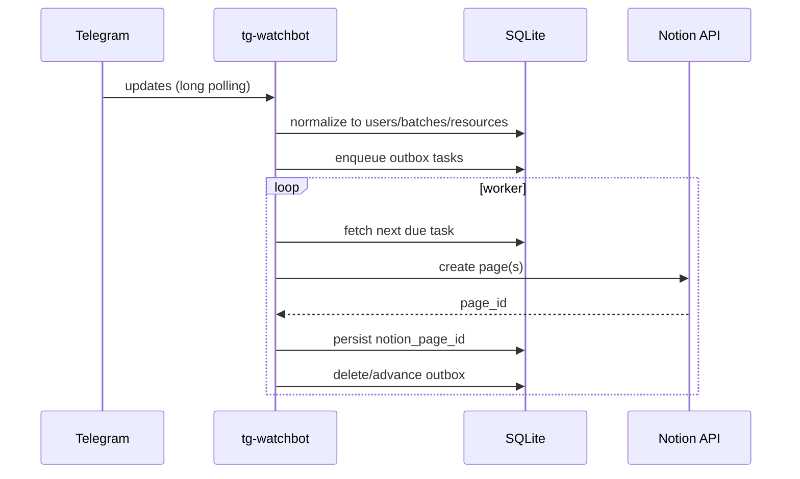

# tg-watchbot

Telegram → Notion bot in Rust with SQLite persistence and an outbox worker.

## Configuration

The bot loads a single YAML config file. Copy `example.config.yaml` to `config.yaml` and fill in your tokens and database IDs.

Minimal run command:

```
RUST_LOG=info cargo run -- --config ./config.yaml
```

The schema is exactly as follows (see `example.config.yaml`):

```
app:
  data_dir: "./data"
  poll_interval_ms: 500
  max_backoff_seconds: 60

telegram:
  bot_token: "YOUR_TELEGRAM_BOT_TOKEN"
  allowed_users:
    - 123456789

notion:
  token: "YOUR_NOTION_INTEGRATION_TOKEN"
  version: "2022-06-28"

  databases:
    main:
      id: "NOTION_MAIN_DATABASE_ID"
      fields:
        title: "Title"
        unique: "Unique"
    resource:
      id: "NOTION_RESOURCE_DATABASE_ID"
      fields:
        relation: "Main"
        order: "No"
        text: "Text"
        media: "Media"
```

## Usage

```bash
git clone https://github.com/JoverZhang/tg-watchbot.git
cp example.config.yaml config.yaml
# edit config.yaml
mkdir -p data
touch data/watchbot.db
docker run --name tg-watchbot -v $PWD/data:/app/data tg-watchbot
```

## Runtime overview



Logging via `tracing` supports env filters. Examples:

- `RUST_LOG=info,sqlx=warn` for concise logs
- `RUST_LOG=debug,tg_watchbot=trace` for deep debugging

## CI

- Lint + build + test run via GitHub Actions (see `.github/workflows/ci.yml`).
- The workflow skips the live Notion test by default. To enable it, add a repository secret `TG_WATCHBOT_CONFIG_YAML` containing the full YAML contents of your `config.yaml` (tokens, database IDs). The job will write this file and run `cargo test --test notion_it -- --nocapture`.
